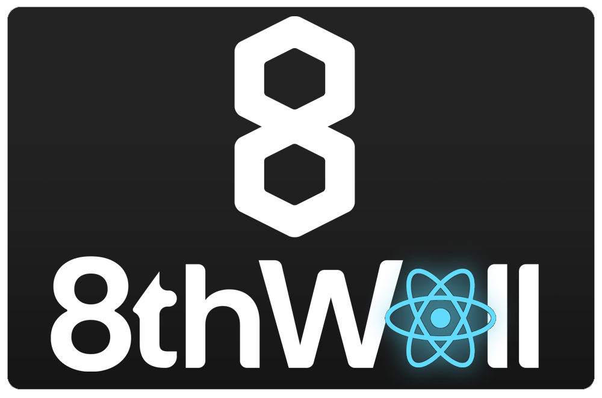
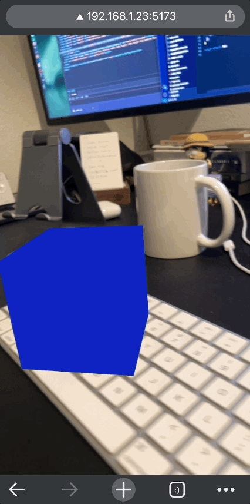

<p align="center">
  
</p>
<h1 align="center">React Three + 8thWall</h1>
<h3 align="center">Create AR applications on 8th Wall, in the best way possible: Declaratively.😉</h3>

<br>

`React Three + 8thWall` is a collection of examples and boilerplate project that enable developers to use <b>React Three.js and Drei components</b> on your AR project for 8thwall.

#### Quick-start:

🤩 It's simple as simple as...
`git clone <this repo>`
🚀 Then, install and run:
`npm install`
`npm run dev`

---

#### How about SSL Certificates?

8thwall has a weird way of generating SSL, using webpack and a confusing serve.bat file... 🤢
But this project has everything ready and working, out of box! No need to run multiple tasks in the terminal and deal with multiple processes.

When you run `npm run dev` in the terminal, your IP will show up with a ✨https://✨.

##### You might need to create a SSL cert. for mobile:

The easiest way, it's to use mkcert (https://github.com/FiloSottile/mkcert)
Install:
`brew install mkcert`
and run:
`mkcert -key-file key.pem -cert-file cert.pem <Your I.P>`

then airdrop to phone and install it on your device.

---

#### Examples

Here's a couple of examples I used to test the pipeline. But generally all materials, loaders and components used on Drei or React Three will work (you may face issues with some materials that use camera renders)

### Refraction Material

<p align="center">
  
</p>
```js
import DreiRefraction from './examples';
<DreiRefraction/>
```

### Loading GLTF

<p align="center">
  
</p>
```js
import LoadedGltf from './examples';
<LoadedGltf/>
```

### Animation Example

<p align="center">
  
</p>
```js
import AnimatedBox from './examples';
<AnimatedBox/>
```

### Wobble Material

<p align="center">
  
</p>
```js
import WobbleMaterial from './examples';
<WobbleMaterial/>
```
### Distorted mesh

<p align="center">
  
</p>
```js
import MeshDistortion from './examples';
<MeshDistortion/>
```
<p align="center">
<br/>
<a href="https://www.buymeacoffee.com/vettorazi" target="_blank"></a>
</p>
